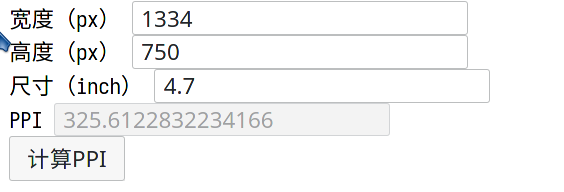

# ppi

[返回主目录](../README.md)

## 介绍

利用javascript进行计算PPI

## 实际效果

可以到我的[博客](https://anidea.gitee.io/post/jsdemoppi/)体验下实实在在的效果。 
这个demo产生的过程参见我的[文章](https://blog.csdn.net/weixin_43031092/article/details/114119395)

## 预览图

## 如何使用

方法一：把[PPI 计算器](ppi.html)的代码下载下来用浏览器打开即可。

方法二：在自己电脑上新建一个html文件，复制[PPI 计算器](ppi.html)的代码粘贴进去保存即可，然后用浏览器打开即可。
